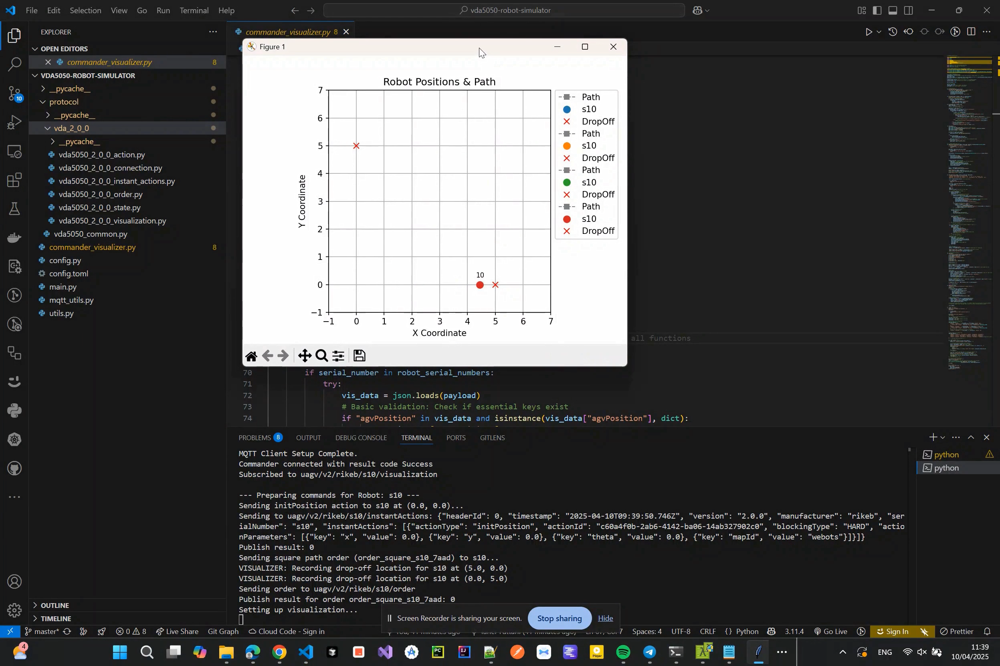

# VDA5050 Robot Simulator

Python-based simulation environment for robots with VDA 5050 protocol (specifically targeting version 2.0.0). It allows simulating multiple AGVs (Automated Guided Vehicles), sending them orders, and visualizing their movement and status via MQTT.

## Demo Video
[](https://youtu.be/wxV-e8J-8gQ)

## Features

* **VDA 5050 v2.0.0 Compliance:** Simulates key aspects of the VDA 5050 protocol including:
    * Connection states (`ONLINE`, `OFFLINE`, `CONNECTION_BROKEN`)
    * Vehicle State (`State`, `AgvPosition`, `ActionState`, etc.)
    * Order processing (`Order`, `Node`, `Edge`)
    * Instant Actions (`InstantActions`, `Action`)
    * Visualization messages (`Visualization`)
* **Multi-Robot Simulation:** Can simulate multiple AGVs concurrently, configured via `config.toml`.
* **Collision Prevention:** Circular AMR footprints never overlap on the same map; blocked vehicles wait until their path is clear.
* **MQTT Communication:** Uses MQTT for communication between the simulator, commander, and potentially other systems.
* **Commander & Visualizer:** Separate launchers handle command publishing and telemetry display:
    * `commander.py` sends edge-ordered `Order` commands without resetting robot positions; instant actions remain available through its API.
    * `visualizer.py` subscribes to robot topics and displays the route, live positions, and status using Matplotlib; it does not publish MQTT messages.
* **Configurable:** Simulation parameters (MQTT broker details, vehicle properties, simulation speed, robot count, etc.) are managed through a `config.toml` file.
* **Modular Protocol Definitions:** VDA 5050 message structures are defined using Python dataclasses in the `protocol` directory.

## Structure

```vda5050-robot-simulator/
├── config.toml             # MQTT, simulation, and floorplan configuration
├── config.py               # Loads configuration from config.toml
├── main.py                 # Simulator task orchestration and entry point
├── vehicle_simulator.py    # Per-AMR state, battery, and telemetry
├── simulator_actions.py    # Instant and node action behavior
├── simulator_orders.py     # Order acceptance and state construction
├── simulator_movement.py   # Simulation tick and route traversal
├── mqtt_client.py          # Per-AMR MQTT transport
├── commander.py            # Publishes commands and subscribes to completion states
├── visualizer.py           # Displays route and subscribes to AMR telemetry
├── commander_visualizer.py # Compatibility launcher for the visualizer
├── route_utils.py          # Shared route loading and edge-order traversal
├── mqtt_utils.py           # MQTT connection and topic utilities
├── utils.py                # Helper functions (timestamps, math)
└── protocol/               # VDA5050 protocol message definitions
├── vda5050_common.py   # Common data structures
└── vda_2_0_0/          # VDA 5050 v2.0.0 specific messages
├── vda5050_2_0_0_action.py
├── vda5050_2_0_0_connection.py
├── vda5050_2_0_0_instant_actions.py
├── vda5050_2_0_0_order.py
├── vda5050_2_0_0_state.py
└── vda5050_2_0_0_visualization.py
```

## Setup

1.  **Dependencies:** 
    * `paho-mqtt` (For MQTT communication)
    * `matplotlib` (For visualization)
    * `tomli` (or `toml` for Python 3.11+) (For reading the config file)
    ```bash
    pip install paho-mqtt matplotlib tomli
    ```
2.  **Configuration:** Create a `config.toml` file in the root directory. Based on `config.py`, it should look something like this:
    ```toml
    [mqtt_broker]
    host = "your_mqtt_broker_host" # e.g., "localhost" or IP address
    port = "1883" # Default MQTT port
    vda_interface = "uagv" # Example interface name

    [vehicle]
    manufacturer = "YourCompany"
    serial_number = "SimRobot" # Base serial number, index is appended
    vda_version = "2.0.0"
    vda_full_version = "VDA5050_V2.0.0" # Matches the protocol files
    collision_radius = 0.5 # Default AMR footprint radius, in map units

    [settings]
    action_time = 2.0   # Time in seconds for simulated actions (e.g., dropOff)
    speed = 0.5         # Simulation speed (units per tick)
    robot_count = 3     # Number of robots to simulate
    spawn_x = 0.0       # First robot's startup X coordinate
    spawn_y = 0.0       # First robot's startup Y coordinate
    spawn_offset_x = 1.5 # X offset per additional robot
    spawn_offset_y = 0.0 # Y offset per additional robot
    state_frequency = 1 # Hz (Publish state message 1 time per second)
    visualization_frequency = 10 # Hz (Publish visualization 10 times per second)
    map_id = "map1"     # Default map ID
    floorplan_x = 65.0   # Floorplan width, in meters
    floorplan_y = 40.0   # Floorplan height, in meters
    background_image = "floorplan.png" # Image file in the project directory
    battery_consumption_per_meter = 0.1 # Battery percentage points consumed per meter
    battery_charging_rate_per_second = 2.0 # Percentage points restored per second at charging nodes
    battery_health_min = 50 # Minimum AMR battery condition, in percent
    battery_health_max = 100 # Maximum AMR battery condition, in percent
    ```
    *Update `mqtt_broker.host` and other settings as needed.*

### Collision Radii

Set `vehicle.collision_radius` to change the default radius (0.5 map units). Override individual AMRs by adding this table at the end of `config.toml`, using their full serial numbers:

```toml
[settings.collision_radii]
AMR1 = 0.75
AMR2 = 0.5
```

Radii must be finite and greater than zero. Two AMRs on the same map must remain at least the sum of their radii apart; touching is allowed. Collision checks cover the entire movement segment, including arrival snaps. Blocked AMRs stop without consuming movement battery, report `safetyState.fieldViolation`, and retry on subsequent ticks. Overlapping `initPosition` actions fail without changing position, and overlapping configured startup positions are rejected. This prevents collisions but does not reroute vehicles or resolve head-on deadlocks.

### Startup Positions

Set `settings.spawn_x` and `settings.spawn_y` for the first AMR. Robot index `i` (starting at zero) spawns at `(spawn_x + i * spawn_offset_x, spawn_y + i * spawn_offset_y)`. Either offset can be zero or negative, and both can be used together. Coordinates and offsets must be finite. Defaults are `(0.0, 0.0)` with an X offset of `1.5` and a Y offset of `0.0`.

The full fleet layout is checked before any MQTT connections start. If footprints overlap, startup fails with an error instead of relocating robots randomly. Increase the offsets or reduce the radii to resolve the overlap. The commander no longer sends automatic `initPosition` actions on discovery. Both visualizer launchers only subscribe to telemetry and never reset positions.

## Usage

1.  **Start an MQTT Broker:** Ensure an MQTT broker such as [Mosquitto](https://mosquitto.org/) is running and accessible based on your `config.toml`.
2.  **Run the Simulator:**
    ```bash
    python main.py
    ```
    This will start simulating the number of robots specified in `config.toml`. Each robot will connect to the MQTT broker and start publishing its state and visualization data.
3.  **Run the Visualizer:**
    ```bash
    python visualizer.py
    ```
    This opens the configured route immediately and subscribes for live robot positions and status when the broker is available. It remains useful offline to inspect the route.
4.  **Run the Commander in a separate terminal:**
    ```bash
    python commander.py
    ```
    The commander discovers robots, sends route orders without resetting their positions, and automatically sends the next route when an order completes. Use `--disable-initial-commands` or `--disable-auto-reorder` to disable either behavior.

## How it Works

* **`main.py`**: Creates multiple `VehicleSimulator` instances based on `robot_count`. Each instance runs asynchronously, managing its own state according to VDA5050 rules. It listens for `order` and `instantActions` topics and publishes `connection`, `state`, and `visualization` topics. Robot movement is simulated by incrementally updating positions towards the next node in the order. Actions like `dropOff` introduce delays.
* **`commander.py`**: Publishes edge-ordered route orders from `route_edges.json` without resetting startup positions, and listens for order completion to support automatic reordering.
* **`visualizer.py`**: Draws nodes from `route_nodes.json` and visual connections from each node's `neghbour_nodes` list. It subscribes to `/visualization` and `/state`, never publishes commands, and can be launched without the broker to inspect the map offline.
* **Charging stations**: Set `charging_station = true` on route nodes in `route_nodes.json`. AMRs charge while stopped at those nodes, then resume their orders when full. The charge rate is controlled by `battery_charging_rate_per_second`.
* **`protocol/`**: Contains dataclasses representing the JSON structures defined by the VDA 5050 specification, making it easier to create, parse, and validate messages.
* **MQTT Topics**: Communication follows the VDA5050 topic structure: `<interface>/<version>/<manufacturer>/<serialNumber>/<topic>`.
